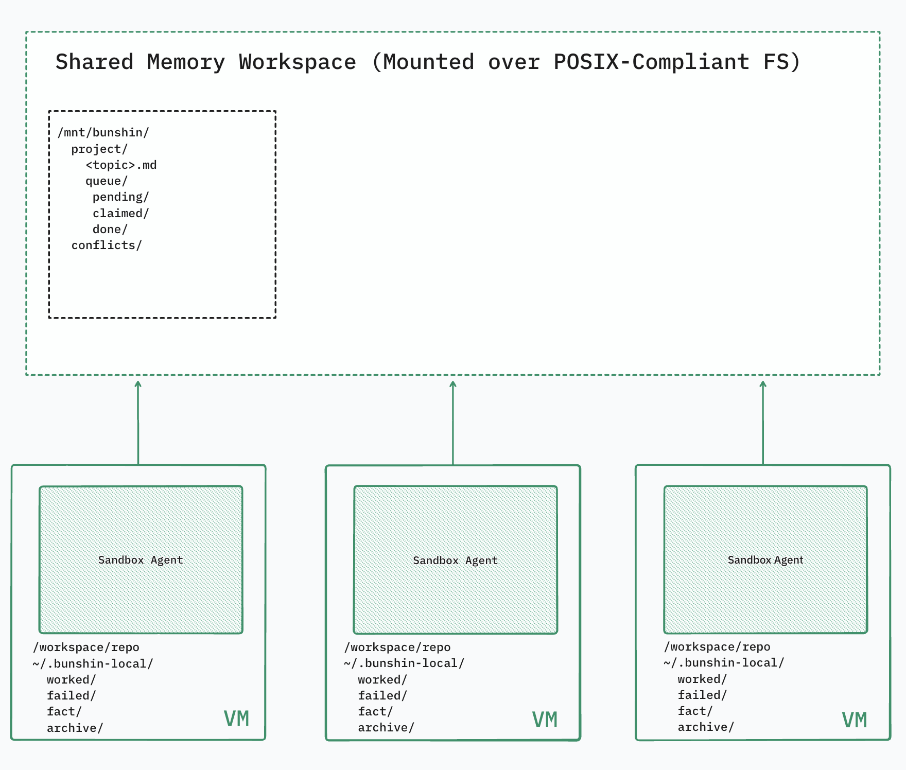

# Bunshin

Local-first, filesystem-based memory for parallel coding agents. Capture what you learn, share what matters, and build up team knowledge over time.

## How It Works



**Two Memory Scopes**

- **Local** — Personal working notes, experiments, and temporary captures tied to your sandbox
- **Shared** — Reviewed, approved knowledge organized by topic and available to all agents

**Memory Entry (JSON)**

```json
{
  "id": "bunshin-20250417-143052-a3f7b2",
  "agent": "pi-coder-1",
  "type": "worked",
  "summary": "Using worker_threads for CPU-bound tasks",
  "tags": ["nodejs", "performance"],
  "paths": ["src/worker-pool.ts", "tests/bench.worker.test.ts"],
  "body": "Spawning workers via MessageChannel instead of SharedArrayBuffer...",
  "createdAt": "2025-04-17T14:30:52Z",
  "submittedAt": "2025-04-17T15:12:08Z"
}
```

**The Flow**

1. **Capture** — Agents write local memory notes (what worked, what failed, facts learned)
2. **Submit** — High-value notes enter a shared review queue
3. **Review** — A reviewer agent analyzes each note, comparing against existing topic memory
4. **Publish** — Accepted notes become part of the shared knowledge base
5. **Compact** — Periodic consolidation keeps topic files clean and reduces drift

## Memory Model

**Types:**
- `worked` — Confirmed solutions, successful patterns
- `failed` — Failure modes, pitfalls to avoid  
- `fact` — Stable guidance, architectural decisions

**Topic Structure:**

Shared memory is organized in markdown topics with three sections:

**Topic Entry (Markdown frontmatter)**

```markdown
---
id: topic-20250417-151208-d9e4c1
sourceNoteId: bunshin-20250417-143052-a3f7b2
addedAt: 2025-04-17T15:12:08Z
validatedAt: 2025-04-20T09:45:33Z
---

Use worker_threads for CPU-bound tasks in Node.js. Prefer MessageChannel
for coordination; avoid SharedArrayBuffer unless profiling shows it's needed.
```

- **Working** — Active experiments, temporary solutions
- **Long-term** — Confirmed patterns, stable knowledge
- **History** — Superseded approaches, deprecated decisions

**Queue States:**


**Queue Item (JSON)**

```json
{
  "id": "queue-20250417-151208-d9e4c1",
  "noteId": "bunshin-20250417-143052-a3f7b2",
  "state": "claimed",
  "claimedBy": "pi-reviewer",
  "claimedAt": "2025-04-17T15:20:00Z",
  "decision": null,
  "reason": null,
  "reviewedAt": null
}
```

**Review Action (JSON)**

```json
{
  "queueId": "queue-20250417-151208-d9e4c1",
  "decision": "publish",
  "reason": "Verified against worker_threads docs; aligns with existing patterns",
  "topic": "nodejs-concurrency",
  "section": "working"
}
```

- `pending` — Awaiting review
- `claimed` — Locked by a reviewer
- `done` — Published, rejected, or escalated

## CLI


```bash
# Initialize bunshin in a project
bunshin init

# Create a local memory note
bunshin note <type> --summary "..." [--tags a,b] [--paths src/...] [--submit]

# Submit a local note to shared review
bunshin submit <memory-id>

# Review the next queued item (reviewer only)
bunshin review --peek
bunshin review --queue-id <id> --decision <publish|reject|escalate> --reason "..."

# Search memory (local + shared by default)
bunshin find <keywords> [--type <worked|failed|fact>] [--tag <tag>] [--no-local]

# View queue and project state
bunshin status

# Display a specific memory or topic
bunshin show <memory-id-or-topic>
```

**Global Options:**
```bash
--local-root <path>     # Override local storage path
--shared-root <path>    # Override shared storage path
--agent <name>          # Override agent name
--reviewer <name>       # Override reviewer name
```

## Pi Extension

When loaded in Pi, these tools become available to agents:

**Worker Agents**
- `bunshin_find` — Search shared and local memory (keywords are OR-matched)
- `bunshin_note` — Capture a local memory; pass `submit=true` to queue for review

**Reviewer Agents**  
- `bunshin_peek` — Claim and inspect the next queue item with topic context
- `bunshin_review` — Complete review with publish/reject/escalate decision
- `bunshin_compact` — Rewrite and consolidate a topic file

**Environment:**
- `BUNSHIN_AGENT_NAME` — Identify the running agent
- `BUNSHIN_REVIEWER_NAME` — Identify the reviewer agent
- `BUNSHIN_REVIEWER_WATCH_QUEUE` — Enable queue polling
- `BUNSHIN_REVIEWER_AUTO_PROCESS` — Auto-trigger reviews when idle

## Quick Start

```bash
# Install dependencies and build
npm install
npm run build

# Set up in a project
cd your-project
bunshin init

# Write your first note
bunshin note fact --summary "Use strict mode by default" --tags typescript --submit

# Check the queue
bunshin status
```
